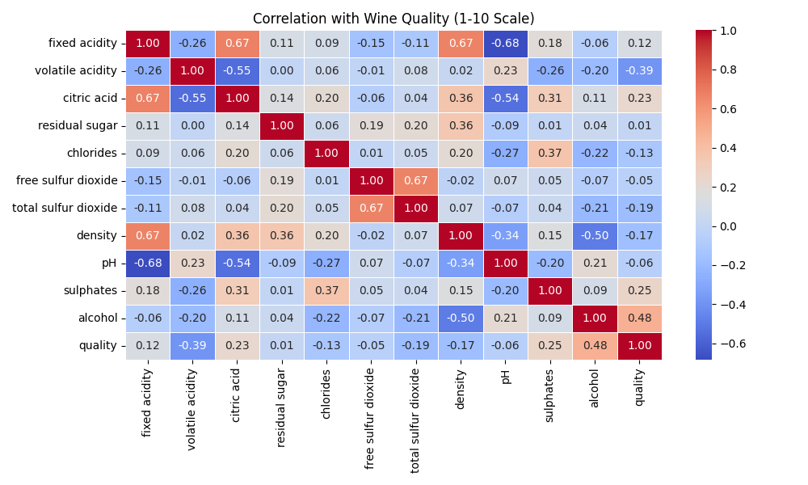

# 🍷 Wine Quality Prediction  
  

## 🔍 Key Insights  
- **Alcohol** shows strongest positive correlation with quality (0.48)  
- **Volatile acidity** negatively impacts quality (-0.39)  
- Achieved **R²: 0.525** using Random Forest  

## 🚀 Quick Start  
```bash
git clone https://github.com/MuhammadHassan667/wine-quality-prediction.git
pip install -r requirements.txt
jupyter notebook wine_quality.ipynb
